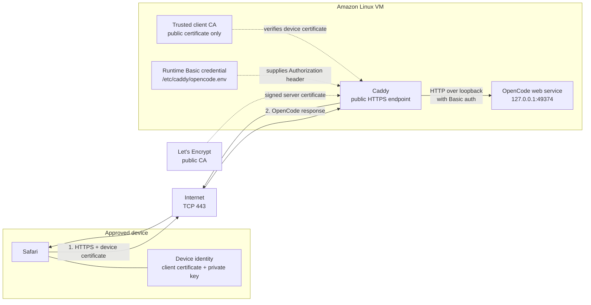

# OpenCode web access

The server profile publishes OpenCode at
`https://josephhaaga.sh.tribe.ai` without exposing the OpenCode process itself.
An approved device must authenticate to Caddy with a client certificate before
Caddy will proxy any HTTP request.

## Request flow

There are two separate certificate directions during the TLS handshake:

1. Caddy presents its Let's Encrypt **server certificate**. Safari verifies
   that a public CA signed it and that it is valid for
   `josephhaaga.sh.tribe.ai`. This proves the device reached the intended
   server.
2. Safari presents its **client certificate**. Caddy verifies that the private
   client CA signed it and that it is valid for client authentication. This
   proves the request came from an approved device.

Requiring both checks is mutual TLS, or mTLS. A connection without an approved
client certificate is rejected during TLS negotiation, before OpenCode sees an
HTTP request.

## Certificates and keys

| Material | Location | Secret? | Purpose |
| --- | --- | --- | --- |
| Let's Encrypt server certificate | Caddy-managed runtime state on the VM | No | Identifies the public hostname to Safari |
| Let's Encrypt server private key | Caddy-managed runtime state on the VM | Yes | Proves Caddy owns the server certificate |
| Client CA certificate | `~/.config/caddy/client-ca.pem` on the VM and in dotfiles | No | Lets Caddy verify approved device certificates |
| Client CA private key | `~/.local/share/dotfiles/caddy-ca` outside Git | Yes | Issues and revokes trust by replacing device certificates |
| Device certificate | Installed on each approved Mac or iPhone | No | Identifies that device as approved |
| Device private key | Installed with the device certificate, commonly via `.p12` | Yes | Proves the device owns its certificate |

A certificate is public metadata containing an identity and public key. Its
matching private key is the secret proof of ownership. Committing the client CA
certificate is safe; committing the client CA private key or any device private
key would let an attacker mint or use an approved identity.

Each device should have its own certificate and private key. The `.p12` file
used for installation packages those together and is therefore secret even
though its certificate portion is public.

## Loopback proxy hop

`127.0.0.1` is the VM's loopback interface: traffic sent there stays inside the
VM and is not routable from the internet. OpenCode listens only on
`127.0.0.1:49374`, while Caddy alone listens publicly on ports 80 and 443.

After mTLS succeeds, Caddy forwards the request to OpenCode over this internal
hop. OpenCode still requires its generated Basic-auth password. Caddy reads
that password from OpenCode's local runtime state, stores the derived header in
the root-owned `/etc/caddy/opencode.env`, and adds the `Authorization` header to
the proxied request. The browser never receives or stores this password.

The effective boundaries are:

- Internet to Caddy: encrypted HTTPS, authenticated with the device certificate.
- Caddy to OpenCode: VM-local loopback HTTP, authenticated with OpenCode Basic auth.
- Direct internet to OpenCode: impossible because OpenCode is not bound to a public interface.

## Other client connections

Local TUI attachment and OpenAI browser OAuth use separate SSH tunnels with
different lifetimes. See [OpenCode VM connections](opencode-vm-connections.md)
for all three connection paths and their commands.

## Secret handling

Only non-secret configuration and the public client CA certificate belong in
dotfiles. Do not commit the client CA private key, device private keys, `.p12`
files, OpenCode's generated password, or `/etc/caddy/opencode.env`.

Back up `~/.local/share/dotfiles/caddy-ca` securely. Losing the CA private key
means new device certificates cannot be issued. If it is exposed, create a new
CA, replace the trusted public CA on the VM, and issue new identities for every
device.
